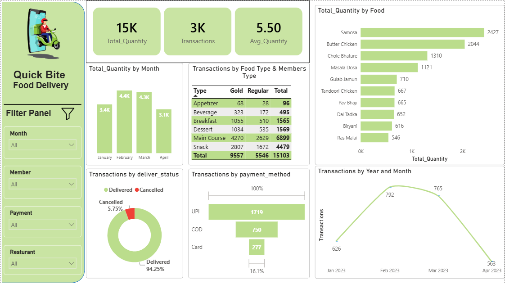

🛵 Quick Bite Food Delivery Analytics - Power BI Project
Quick Bite Food Delivery Analytics Dashboard serves as a practical example of how Power BI can be leveraged to solve real-world business challenges by delivering actionable insights that help organizations optimize performance, increase profitability, and provide a better customer experience.

# 🛵 Quick Bite Food Delivery Analytics - Power BI Project

An end-to-end Power BI analytics project evaluating food delivery order performance, customer behavior, fulfillment status, and payment preference trends for **Quick Bite Food Delivery**.

---

## 📊 Executive Summary Dashboard

---

## 🚀 Key Insights & Metrics

* **Total Quantity Sold:** ~15,000 units
* **Total Transactions:** ~3,000 orders
* **Average Order Quantity:** 5.50 items/order
* **Order Fulfillment Rate:** 94.25% Delivered | 5.75% Cancelled
* **Top Popular Food Items:** Samosa (2,427 items), Butter Chicken (2,044 items), Chole Bhature (1,310 items)
* **Preferred Payment Method:** UPI leads significantly over Cash-on-Delivery (COD) and Card payments.

---

## 🛠️ Data Model & Architecture

The report uses a **Star Schema** to enable efficient aggregation and filtering across dimensions:

* **Fact Table:** `Sales Data` (Order IDs, Order Dates, Quantities, Delivery Status, Payment Methods)
* **Dimension Tables:**
  * `Customer Details` (`customer_id`, `customer_name`, `member_Type`)
  * `Food_Details` (`Fooditem`, `Food`, `Type`)
  * `Resturant_Details` (`Resturant_Id`, `Resturant_Code`, `Resturant_type`)

---

## ⚙️ Steps to Reproduce / Technical Details

1. **Data ETL (Power Query):** Cleaned raw datasets, fixed data types, promoted headers, and removed nulls/errors.
2. **Data Modeling:** Established 1-to-Many relationships connecting dimension tables to the main sales fact table.
3. **DAX Measures:** Formulated DAX calculations for total quantities, transaction counts, average order sizes, and status percentages.
4. **Dashboard Layout:** Structured custom visual components including slicers, cards, doughnut charts, matrix views, and top-item bar charts.

---

